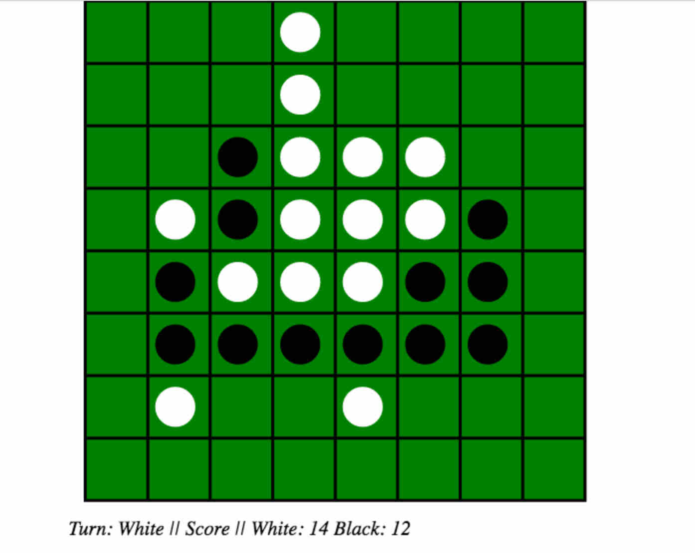
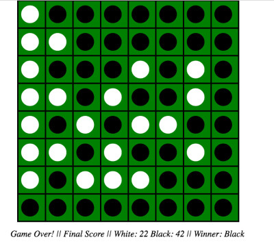

# h-reversi
Haskell blank canvas reversi game  

[](https://travis-ci.org/apoorvingle/h-reversi)  

### Installation

```
$ git clone https://github.com/apoorvingle/h-reversi.git
$ cd h-reversi
$ cabal sandbox init
$ cabal install --dependencies-only
```

### Test
```
$ cabal configure --enable-tests
$ cabal install --enable-tests
$ cabal build && cabal test
```

### Run
```
$ cabal clean && cabal configure && cabal install && ./.cabal-sandbox/bin/h-reversi
```

### browser

```
http://localhost:3000
```

### How to play
[Reversi wiki](https://en.wikipedia.org/wiki/Reversi)

### Screenshots


